# lstmRNN


## 概述
中文分词、词性标注、命名实体识别、机器翻译、语音识别都属于序列挖掘的范畴。序列挖掘的特点就是某一步的输出不仅依赖于这一步的输入，还依赖于其他步的输入或输出。在序列挖掘领域传统的机器学习方法有HMM（Hidden Markov Model，隐马尔可夫模型）和CRF（Conditional Random Field，条件随机场），近年来又开始流行深度学习算法RNN（Recurrent Neural Networks，循环神经网络）。


## 学习目标与学习方法
掌握RNN lstm的基本原理。


## 循环神经网络 (RNN)

CNN等传统神经网络的局限在于：将固定大小的向量作为输入（比如一张图片），然后输出一个固定大小的向量（比如不同分类的概率）。不仅如此，CNN还按照固定的计算步骤（比如模型中层的数量）来实现这样的输入输出。这样的神经网络没有持久性：假设你希望对电影中每一帧的事件类型进行分类，传统的神经网络就没有办法使用电影中先前的事件推断后续的事件。

* RNN 是包含循环的网络，可以把信息从上一步传递到下一步。
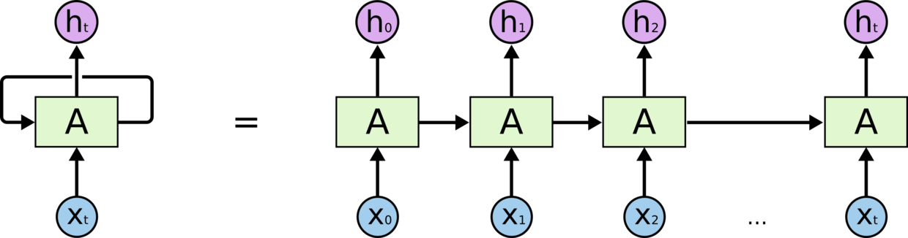


RNN的循环展开之后其实就是同一个网络复制多份，次序连接进行信息传递。

* RNN允许信息的持久化，对当前的状态保留记忆（以隐变量的方式存在，也就是图中计算h_{t}需要用到h_{t-1}的信息）。对于同一个RNN来说，其“A结构”（绿色部分）是固定的（共享一套参数，毕竟是从循环展开来的啊肯定是一样的）。

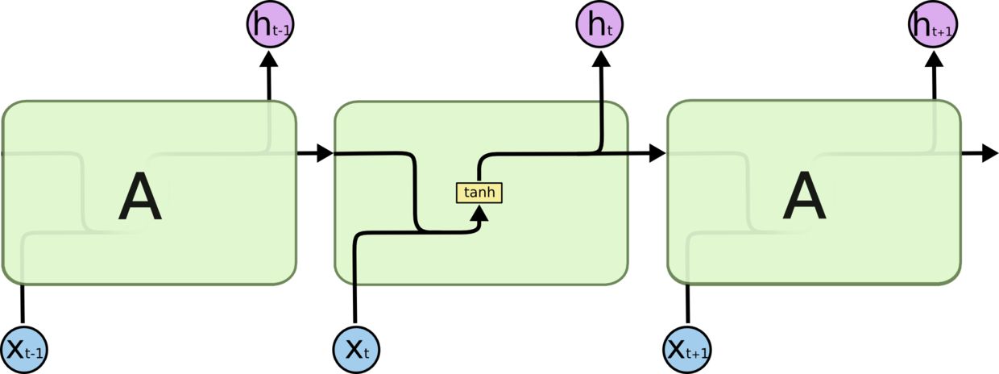

A代表神经网络的一部分（传统CNN的A中只有一个非常简单的结构，例如图中的tanh层）。X_{t}代表t时刻的输入，h_{t}代表t时刻的输出

* RNN允许人们对向量序列进行操作（无论是输入还是输出）。
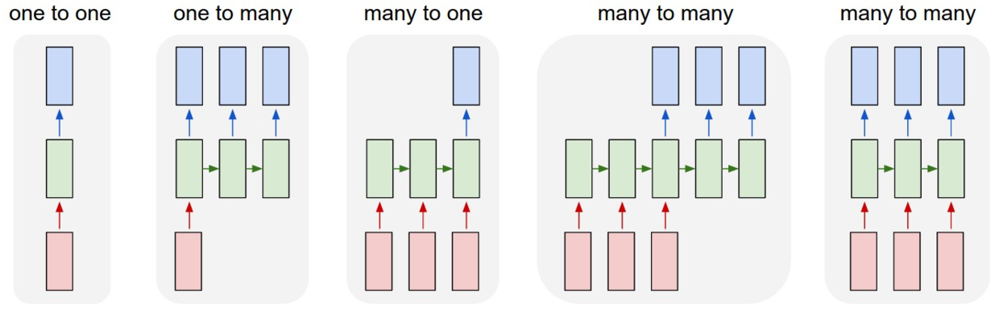


RNN对向量序列的操作，红、绿、蓝矩形分别代表输入、“A结构”和输出，箭头代表向量flow以及特定函数（矩阵乘法等等）

上图中的5个例子从左到右分别是：

* 没有使用RNN，从固定大小的输入得到固定大小输出（比如图像分类）
* 序列输出（比如图片描述，输入一张图片输出一段文字序列）
* 序列输入（比如情感分析，输入一段文字然后将它分类成积极或者消极情感）
* 序列输入和序列输出（比如机器翻译）
* 同步序列输入输出（比如视频分类，对视频中每一帧打标签）

## RNN弊端和LSTM

### RNN 的弊端


之前我们说过, RNN 是在有顺序的数据上进行学习的. 为了记住这些数据, RNN 会像人一样产生对先前发生事件的记忆. 不过一般形式的 RNN 就像一个老爷爷, 有时候比较健忘. 为什么会这样呢?
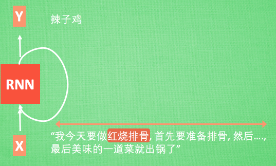

想像现在有这样一个 RNN, 他的输入值是一句话: ‘我今天要做红烧排骨, 首先要准备排骨, 然后…., 最后美味的一道菜就出锅了’, shua ~ 说着说着就流口水了. 现在请 RNN 来分析, 我今天做的到底是什么菜呢. RNN可能会给出“辣子鸡”这个答案. 由于判断失误, RNN就要开始学习 这个长序列 X 和 ‘红烧排骨’ 的关系 , 而RNN需要的关键信息 ”红烧排骨”却出现在句子开头。

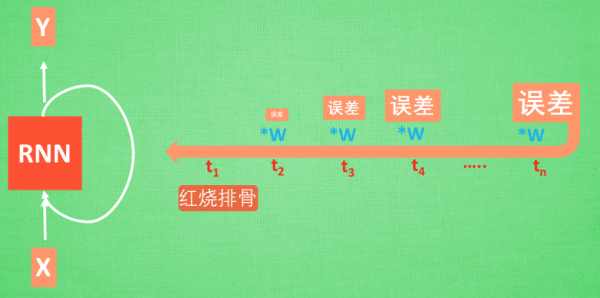
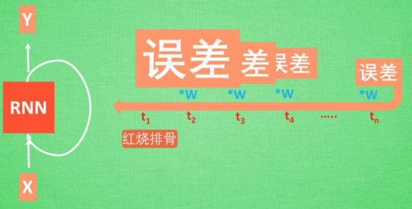

再来看看 RNN是怎样学习的吧. 红烧排骨这个信息原的记忆要进过长途跋涉才能抵达最后一个时间点. 然后我们得到误差, 而且在 反向传递 得到的误差的时候, 他在每一步都会 乘以一个自己的参数 W. 如果这个 W 是一个小于1 的数, 比如0.9. 这个0.9 不断乘以误差, 误差传到初始时间点也会是一个接近于零的数, 所以对于初始时刻, 误差相当于就消失了. 我们把这个问题叫做梯度消失或者梯度弥散 Gradient vanishing. 反之如果 W 是一个大于1 的数, 比如1.1 不断累乘, 则到最后变成了无穷大的数, RNN被这无穷大的数撑死了, 这种情况我们叫做剃度爆炸, Gradient exploding. 这就是普通 RNN 没有办法回忆起久远记忆的原因.


### LSTM
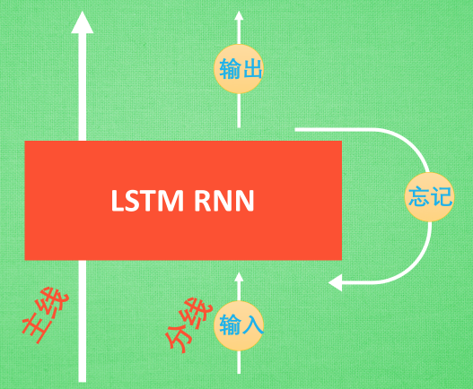

LSTM 就是为了解决这个问题而诞生的. LSTM 和普通 RNN 相比, 多出了三个控制器. (输入控制, 输出控制, 忘记控制). 现在, LSTM RNN 内部的情况是这样.

他多了一个 控制全局的记忆, 我们用粗线代替. 为了方便理解, 我们把粗线想象成电影或游戏当中的 主线剧情. 而原本的 RNN 体系就是 分线剧情. 三个控制器都是在原始的 RNN 体系上, 我们先看 输入方面 , 如果此时的分线剧情对于剧终结果十分重要, 输入控制就会将这个分线剧情按重要程度 写入主线剧情 进行分析. 再看 忘记方面, 如果此时的分线剧情更改了我们对之前剧情的想法, 那么忘记控制就会将之前的某些主线剧情忘记, 按比例替换成现在的新剧情. 所以 主线剧情的更新就取决于输入 和忘记 控制. 最后的输出方面, 输出控制会基于目前的主线剧情和分线剧情判断要输出的到底是什么.基于这些控制机制, LSTM 就像延缓记忆衰退的良药, 可以带来更好的结果.

## Long Short Term Memory 网络 (LSTM)

### 引入

因为RNN的信息只能传递给相邻的后继者（从循环展开之后的表示来看），因此当输出与其相关的输入信息相隔较近的时候，普通的RNN是可以胜任的。

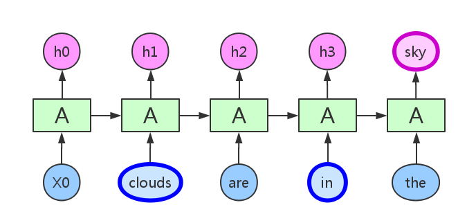

相关信息输入与需要该信息的输出之间间隔不太长

而当这个间隔很长的时候，虽然理论上RNN是可以处理这种长期依赖 (Long Dependencies) 的问题，但是实践中并没有成功。Bengio, et al. (1994)等人对该问题进行了深入的研究，他们发现了使训练 RNN 变得非常困难的根本原因（梯度消失/梯度爆炸）。
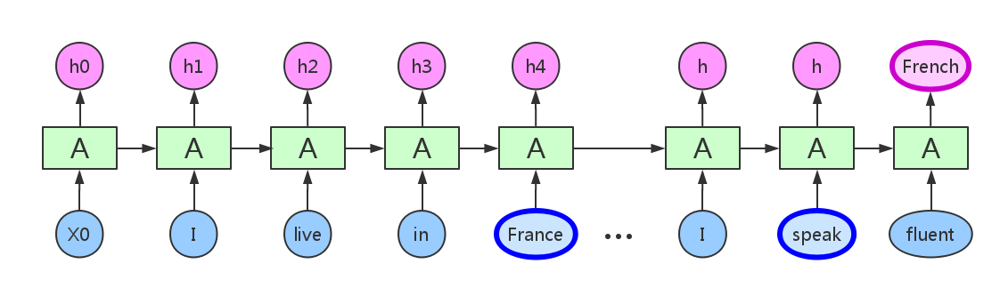

相关信息输入与需要该信息的输出之间间隔很长

因此，Hochreiter & Schmidhuber (1997)提出了Long Short Term Memory 网络 (LSTM)，并在近期被Alex Graves进行了改良和推广。

### LSTM step by step

LSTM的网络结构大体上和传统RNN比较相似，但是重复结构A里面的东西要复杂一些，我们就一步一步来看。

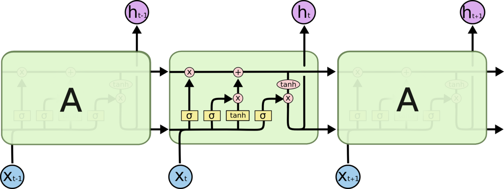

LSTM的重复结构A有四层

首先，LSTM中最重要的核心思想就是所谓的cell state，也就是贯穿每个重复结构的上面这条flow（哇哦是不是想到TensorFlow了）。

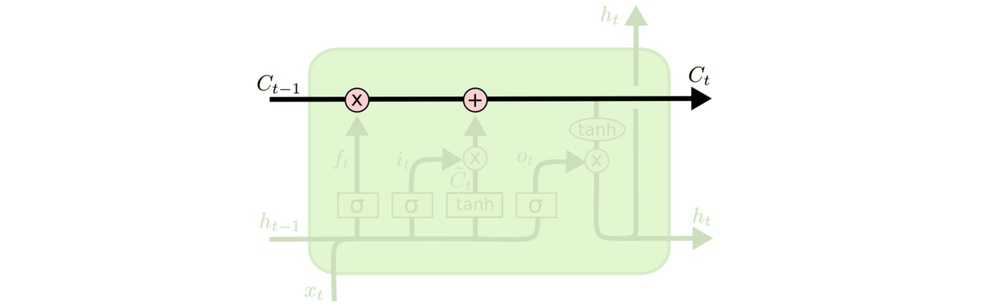

cell state

这条flow其实就承载着之前所有状态的信息，每当flow流经一个重复结构A的时候，都会有相应的操作来决定舍弃什么旧的信息以及添加什么新的信息。对cell state的信息增减进行控制的结构称为门 (gates)。一个LSTM block中有三个这样的门，分别是遗忘门 (forget gate)、输入门 (input gate)、输出门 (output gate)。
### 遗忘门 (forget gate)

遗忘门决定了要从cell state中舍弃什么信息。其通过输入上一状态的输出h_{t-1}、当前状态输入信息X_{t}到一个Sigmoid函数中，产生一个介于0到1之间的数值，与cell state相乘之后来确定舍弃（保留）多少信息。0 表示“完全舍弃”，1 表示“完全保留”。
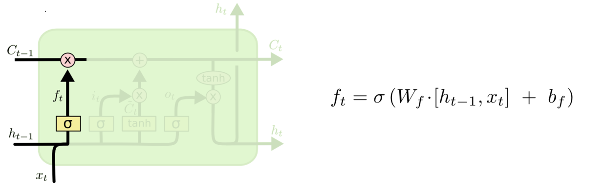

遗忘门 (forget gate)， 在连接 h_{t-1}和 X_{t}之后会乘以一个权值 W_{f}并加上偏置 b_{f}，这就是网络需要学习的参数。若hidden state的大小（也就是size of hidden layer of neurons）为h_size，那么W_{f}的大小就为h_size*h_size。h_size的数值是人工设定的。
### 输入门 (input gate)

输入门决定了要往cell state中保存什么新的信息。其通过输入上一状态的输出h_{t-1}、当前状态输入信息X_{t}到一个Sigmoid函数中，产生一个介于0到1之间的数值i_{t}来确定我们需要保留多少的新信息。同时，一个tanh层会通过上一状态的输出h_{t-1}、当前状态输入信息X_{t}来得到一个将要加入到cell state中的“候选新信息”~C_{t}。将刚才得到的数值i_{t}与“候选新信息”~C_{t}相乘得到我们真正要加入到cell state中的更新信息。
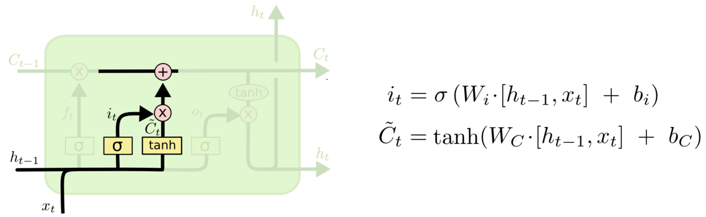

输入门 (input gate)（一个Sigmoid函数层）与tanh层，两个神经网络层都会和之前遗忘门一样学习各自的参数
### 输出门 (output gate)

输出门决定了要从cell state中输出什么信息。与之前类似，会先有一个Sigmoid函数产生一个介于0到1之间的数值o_{t}来确定我们需要输出多少cell state中的信息。cell state的信息在与o_{t}相乘时首先会经过一个tanh层进行“激活”（非线性变换）。得到的就是这个LSTM block的输出信息h_{t}。
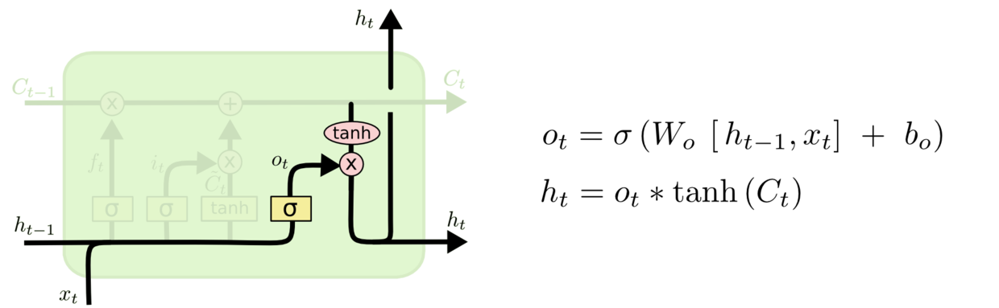

输出门 (output gate)，同样有自己的权值参数需要学习

    注意：一个LSTM block中可能有不止一个cell state（也就是最上面的C_{t}会有不止一条），它们共享输入、输出和遗忘门：S memory cells sharing the same input, output and forget gates form a structure called "a memory cell block of size S". This means that each cell might hold a different value in its memory, but the memory within the block is written to, read from and erased all at once. Memory cell blocks facilitate information storage as with conventional neural nets, it is not so easy to code a distributed input within a single cell. Since each memory cell block has as many gate units as a single memory cell (namely two), the block architecture can be even slightly more efficient. A memory cell block of size 1 is just a simple memory cell.

### 增加网络层数 Going Deep

既然LSTM(RNN)是神经网络，我们自然可以把一个个LSTM叠加起来进行深度学习。比如，我们可以用两个独立的LSTM来构造两层的循环神经网络：一个LSTM接收输入向量，另一个将前一个LSTM的输出作为输入。这两个LSTM没有本质区别——这不外乎就是向量的输入输出而已，而且在反向传播过程中每个模块都伴随着梯度操作。
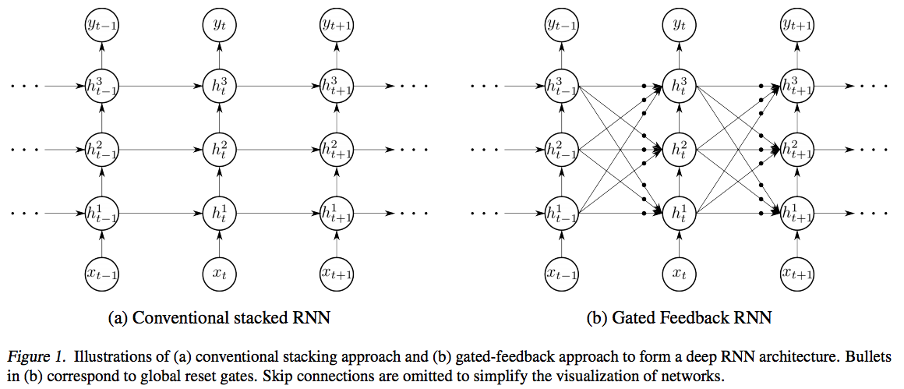

来自Gated Feedback Recurrent Neural Networks，左边是传统的stack RNN（三个RNN叠加），右边是升级版——RNN的hidden state除了会对下一时刻自己产生影响外，还会对其他的RNN产生影响，由reset gates控制

### LSTM 的变体

LSTM在实验和研究过程中发展出了很多的变体，由Schuster & Paliwal (1997)提出的双向RNN的思想和原始版RNN有些许不同，它考虑到当前的输出不止和之前的序列元素有关系，还和之后的序列元素也是有关系的。其实可以把BRNN看做2个RNN叠加。输出的结果就是基于2个RNN的隐状态计算得到的。
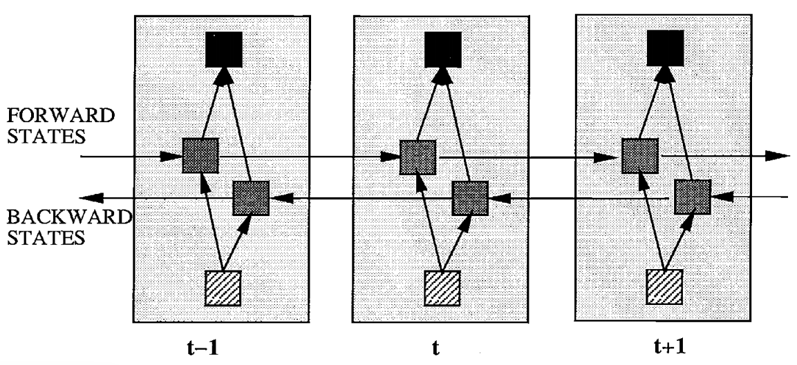

Bidirectional Recurrent Neural Networks

由 Gers & Schmidhuber (2000) 提出的网络增加了 “peephole connection”，把当前的cell state也作为输入给Sigmoid函数。
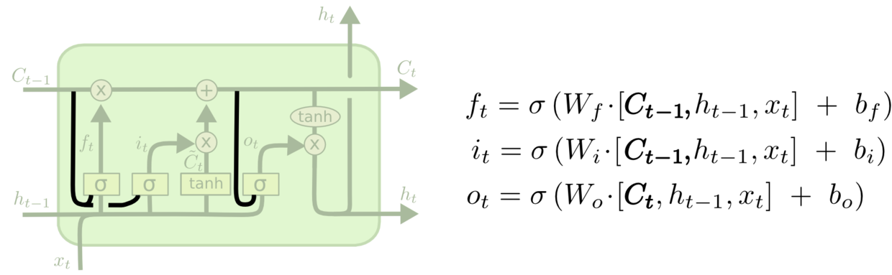
peephole connection

由 Cho, et al. (2014) 提出的Gated Recurrent Unit (GRU)是现在相当流行的一种LSTM变体。它首先将cell state和hidden state进行了合并，然后将原来的三个门替换为了更新门 (update gate)（图中的z_{t}）和重置门 (reset gate)（图中的r_{t}）。重置门用来决定新的hidden state~h_{t}中上一hidden stateh_{t-1}所占的比重，新的hidden state~h_{t}由重置门“过滤”后的h_{t-1}和输入x_{t}经过tanh层激活（非线性变换）后得到；更新门用来决定当前hidden stateh_{t}中新的hidden state~h_{t}所占的比重，控制了最后输出的h_{t}中~h_{t}和h_{t-1}所占的比例。
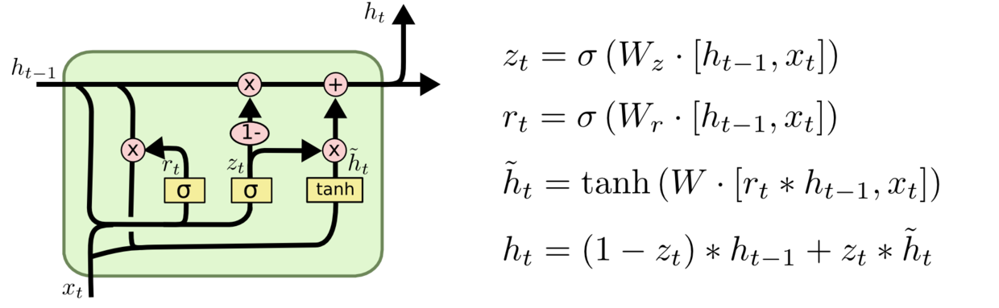

Gated Recurrent Unit (GRU)

除此之外的LSTM变体还有很多，如Yao, et al. (2015) 提出的 Depth Gated RNN。还有用一些完全不同的观点来解决长期依赖的问题，如Koutnik, et al. (2014) 提出的 Clockwork RNN。

### LSTM 模块的功能

也有很多人关注与LSTM各种变体的对比、以及LSTM内部的各个模块对于训练效果到底有什么养的影响上。Jozefowicz, et al. (2015) 在超过 1 万种 RNN 架构上进行了测试，发现一些架构在某些任务上也取得了比 LSTM 更好的结果。

Greff, et al. (2015) 探讨了基于Vanilla LSTM (Graves & Schmidhube (2005))之上的8个变体，并比较了它们之间的性能差异，包括：

1. 没有输入门 (No Input Gate, NIG)
2.    没有遗忘门 (No Forget Gate, NFG)
3.      没有输出门 (No Output Gate, NOG)
4.      没有输入激活函数 (No Input Activation Function, NIAF) （也就是没有输入门对应的tanh层）
5.      没有输出激活函数 (No Output Activation Function, NOAF) （也就是没有输出门对应的tanh层）
6.      没有"peephole connection" (No Peepholes, NP)
7.      遗忘门与输出门结合 (Coupled Input and Forget Gate, CIFG)
8.      Full Gate Recurrence (FGR)
>The FGR variant adds recurrent connections between all the gates (nine additional recurrent weight matrices).
        
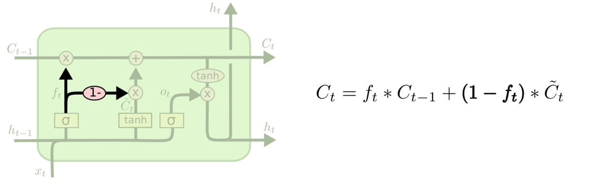

遗忘门与输出门结合 (Coupled Input and Forget Gate, CIFG)

文章使用了将这8种LSTM变体与基本的Vanilla LSTM在TIMIT语音识别、手写字符识别、复调音乐建模三个应用中的表现情况进行了比较，得出了几个有趣的结论：

1. Vanilla LSTM在所有的应用中都有良好的表现，其他8个变体并没有什么性能提升；  
2.   将遗忘门与输出门结合 (Coupled Input and Forget Gate, CIFG)以及没有"peephole connection" (No Peepholes, NP)简化了LSTM的结构，而且并不会对结果产生太大影响；
3.      遗忘门和输出门是LSTM结构最重要的两个部分，其中遗忘门对LSTM的性能影响十分关键，输出门 is necessary whenever the cell state is unbounded （用来限制输出结果的边界）；
4.      学习率和隐含层个数是LSTM最主要的调节参数，而动量因子被发现影响不大，高斯噪音的引入对TIMIT实验性能提升显著，而对于另外两个实验则会带来反效果；
5.      超参分析表明学习率与隐含层个数之间并没有什么关系，因此可以独立调参，另外，学习率可以先使用一个小的网络结构进行校准，这样可以节省很多时间。

### RNN/LSTM 的应用
#### 非序列情况下的RNN

即使输入输出没有涉及到向量序列，RNN仍然可以用序列的方式来进行处理。当输入是固定的向量（门牌图片）时，RNN也可以取得很好的效果。


使用RNN学习阅读门牌号


使用RNN学习书写门牌号
#### 字符级别语言模型

Andrej Karpathy用LSTM训练了一个字符级别的语言模型，具体来说就是向LSTM输入大量的文本数据，然后在一个序列中给定一个前面的字符，用它来建立计算这个序列下一个字符概率的模型。这样就可以一个字符一个字符的生成文本。在博客The Unreasonable Effectiveness of Recurrent Neural Networks中，他展示了使用这个网络训练的5个例子（包括模仿莎士比亚的作品、维基百科页面、人名等等），分别使用了不同的数据集来训练并让其按照学习结果自动按字符生成文本，都得到了不错的效果。

值得一提的是，使用该网络还可以训练代数几何的论文——使用LaTeX源文件进行训练，可以得到像模像样的代数几何文章！这充分说明了该模型在学习复杂句法结构方面表现得相当不错。Andrej Karpathy甚至训练了一个自动写Linux代码的LSTM网络，生成的结果长得还真是有模有样——很少有语法错误，并且对于code block的控制（"{}"和"[]"等等）、缩进格式都很令人满意。

一个简单的RNN网络模型和训练过程如下图。
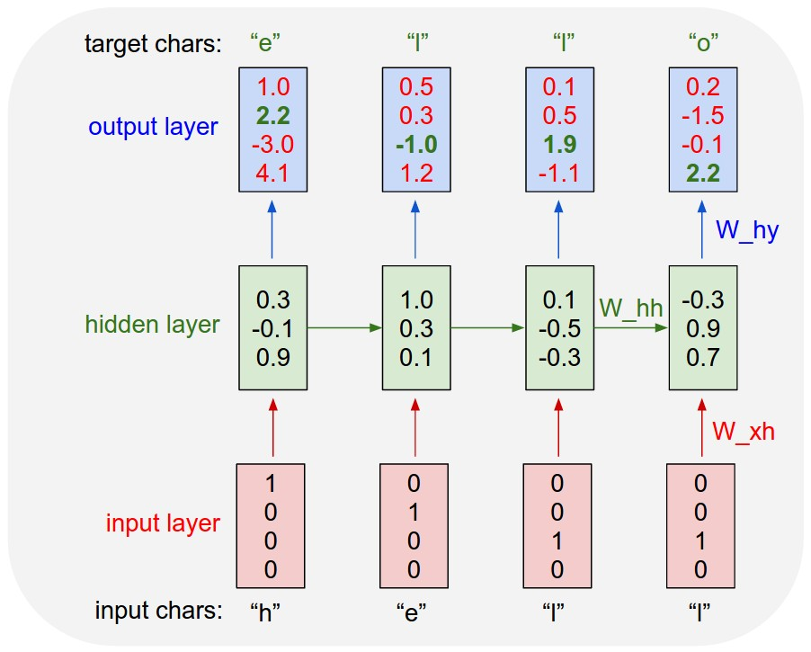

简单的字符级别语言模型RNN，包含一个输入层、一个隐含层（包含3个神经元）和一个输出层。图中展示了将字符序列"hell"输入该RNN时前向传播得到的结果。图中的训练参数为 W_{xh},W_{hh},W_{hy}

图示例子中假设整个字典只有"h","e","l","o"四个字母，使用 1-of-k 进行编码（即向量长度为4，分别代表"h","e","l","o"）。模型使用文本"hello"训练一个RNN。若将"hello"视为一个训练序列，那么该序列实际上包含4个单独的训练样本，即
1. "h"之后应该出现"e"
2.     "he"之后应该出现"l"
3.      "hel"之后应该出现"l"
4.      "hell"之后应该出现"o"

将"hell"作为训练序列输入该RNN后，输出向量的每一位代表当前输入对应的输出可能性大小。例如，对于输入"h"，经过一次前向传播我们得到了输出"h"的可能性为1.0，输出"e"的可能性为2.2，输出"l"的可能性为-3.0，输出"o"的可能性为4.1。由于期望的输出结果是"e"，因此我们希望调整输出向量中绿色的值使其变大，红色的值变小，这就是反向传播要做的事了。之后的训练过程就是不断的进行迭代，直至网络收敛。值得注意的是，字符"l"第一次输入时，得到的结果是"l"，但是第二得到的结果是"o"。因此，这个RNN不能单独依赖于输入数据，必须使用它的循环连接来跟踪前文以达到准确结果。
```
# 迭代100次时
tyntd-iafhatawiaoihrdemot  lytdws  e ,tfti, astai f ogoh eoase rrranbyne 'nhthnee e 
plia tklrgd t o idoe ns,smtt   h ne etie h,hregtrs nigtike,aoaenns lng

# 迭代500次时
we counter. He stutn co des. His stanted out one ofler that concossions and was 
to gearang reay Jotrets and with fre colt otf paitt thin wall. Which das stimn 

# 迭代2000次时
"Why do what that day," replied Natasha, and wishing to himself the fact the
princess, Princess Mary was easier, fed in had oftened him.
Pierre aking his soul came to the packs and drove up his father-in-law women.
```
通过模型每次迭代的中间输出结果我们也可以看到模型的学习过程：从“单词-空格”结构开始，到学习短的单词，单词长度逐渐增加，再到学习覆盖大段文本的“主题”（这就体现出Longer-term dependencies了）。
### Others

在自然语言处理(NLP)领域，RNN已经可以做[语音识别](www.jmlr.org/proceedings/papers/v32/graves14.pdf)、[机器翻译](https://arxiv.org/abs/1409.3215)、[生成手写字符](http://www.cs.toronto.edu/~graves/handwriting.html)，以及构建强大的语言模型 ([Sutskever et al.](http://www.cs.utoronto.ca/~ilya/pubs/2011/LANG-RNN.pdf))， ([Graves](https://arxiv.org/abs/1308.0850))，([Mikolov et al.](http://www.rnnlm.org/))（字符级别和单词级别的都有）。

在机器视觉领域，RNN也非常流行。包括 [帧级别的视频分类](https://arxiv.org/abs/1411.4555)，[图像描述](https://arxiv.org/abs/1411.4389)，[视频描述](https://arxiv.org/abs/1505.00487) 以及[基于图像的Q&A](https://arxiv.org/abs/1505.02074)等等。


## 课程作业
自己根据情况学习相关知识


