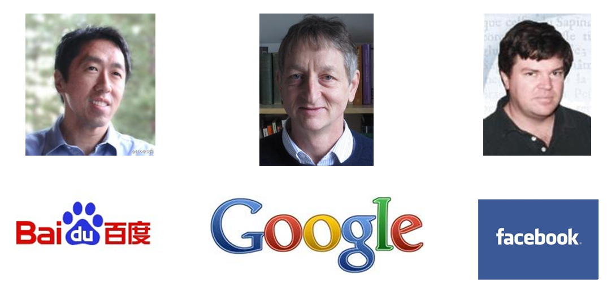
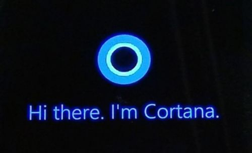

# mlbasic 
## 1.  概述
>图1 机器学习界的执牛耳者与互联网界的大鳄的联姻

图1上的三人是当今机器学习界的执牛耳者。中间的是Geoffrey Hinton, 加拿大多伦多大学的教授，如今被聘为“Google大脑”的负责人。右边的是Yann LeCun, 纽约大学教授，如今是Facebook人工智能实验室的主任。而左边的大家都很熟悉，Andrew Ng，中文名吴恩达，斯坦福大学副教授，如今也是“百度大脑”的负责人与百度首席科学家。这三位都是目前业界炙手可热的大牛，被互联网界大鳄求贤若渴的聘请，足见他们的重要性。而他们的研究方向，则全部都是机器学习的子类--深度学习。

>图2 语音助手产品

这幅图上描述的是什么？Windows Phone上的语音助手Cortana，名字来源于《光环》中士官长的助手。相比其他竞争对手，微软很迟才推出这个服务。Cortana背后的核心技术是什么，为什么它能够听懂人的语音？事实上，这个技术正是机器学习。机器学习是所有语音助手产品(包括Apple的siri与Google的Now)能够跟人交互的关键技术。

通过上面两图，我相信大家可以看出机器学习似乎是一个很重要的，有很多未知特性的技术。学习它似乎是一件有趣的任务。实际上，学习机器学习不仅可以帮助我们了解互联网界最新的趋势，同时也可以知道伴随我们的便利服务的实现技术。

## 2. 学习目标
基本了解机器学习，掌握部分机器学习基础

## 3. 课程内容
* [1.一个故事说明什么是机器学习](content/a story.md)

* [2.机器学习的定义](content/2 definition.md)

* [3.机器学习的范围](content/3 机器学习的范围.md)

* [4.机器学习的方法](content/4 机器学习的方法.md)

* [5.机器学习的应用--大数据](content/5 机器学习的应用–大数据.md)

* [6.机器学习的子类--深度学习](content/6 机器学习的子类–深度学习.md)

* [7.机器学习的父类--人工智能](content/7 机器学习的父类–人工智能.md)

* [8.机器学习的思考--计算机的潜意识](content/8机器学习的思考–计算机的潜意识.md)

* [9.总结](content/9 总结.md)

## 4. 课程作业
自行学习

 

