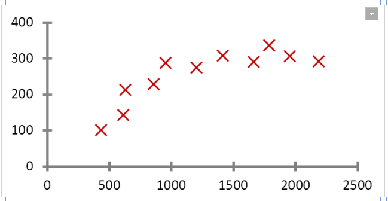
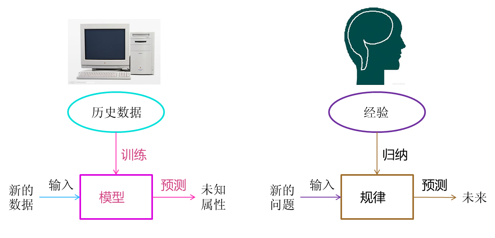

# 2 definition
从广义上来说，机器学习是一种能够赋予机器学习的能力以此让它完成直接编程无法完成的功能的方法。但从实践的意义上来说，机器学习是一种通过利用数据，训练出模型，然后使用模型预测的一种方法。

 

让我们具体看一个例子。

图4 房价的例子

 

拿国民话题的房子来说。现在我手里有一栋房子需要售卖，我应该给它标上多大的价格？房子的面积是100平方米，价格是100万，120万，还是140万？

 

很显然，我希望获得房价与面积的某种规律。那么我该如何获得这个规律？用报纸上的房价平均数据么？还是参考别人面积相似的？无论哪种，似乎都并不是太靠谱。

 

我现在希望获得一个合理的，并且能够最大程度的反映面积与房价关系的规律。于是我调查了周边与我房型类似的一些房子，获得一组数据。这组数据中包含了大大小小房子的面积与价格，如果我能从这组数据中找出面积与价格的规律，那么我就可以得出房子的价格。

 

对规律的寻找很简单，拟合出一条直线，让它“穿过”所有的点，并且与各个点的距离尽可能的小。

 

通过这条直线，我获得了一个能够最佳反映房价与面积规律的规律。这条直线同时也是一个下式所表明的函数：

 

　　房价 = 面积 * a + b

 

上述中的a、b都是直线的参数。获得这些参数以后，我就可以计算出房子的价格。

 

假设a = 0.75,b = 50，则房价 = 100 * 0.75 + 50 = 125万。这个结果与我前面所列的100万，120万，140万都不一样。由于这条直线综合考虑了大部分的情况，因此从“统计”意义上来说，这是一个最合理的预测。

 

在求解过程中透露出了两个信息：
1.房价模型是根据拟合的函数类型决定的。如果是直线，那么拟合出的就是直线方程。如果是其他类型的线，例如抛物线，那么拟合出的就是抛物线方程。机器学习有众多算法，一些强力算法可以拟合出复杂的非线性模型，用来反映一些不是直线所能表达的情况。
2.如果我的数据越多，我的模型就越能够考虑到越多的情况，由此对于新情况的预测效果可能就越好。这是机器学习界“数据为王”思想的一个体现。一般来说(不是绝对)，数据越多，最后机器学习生成的模型预测的效果越好。

 

通过我拟合直线的过程，我们可以对机器学习过程做一个完整的回顾。首先，我们需要在计算机中存储历史的数据。接着，我们将这些 数据通过机器学习算法进行处理，这个过程在机器学习中叫做“训练”，处理的结果可以被我们用来对新的数据进行预测，这个结果一般称之为“模型”。对新数据 的预测过程在机器学习中叫做“预测”。“训练”与“预测”是机器学习的两个过程，“模型”则是过程的中间输出结果，“训练”产生“模型”，“模型”指导 “预测”。

 

让我们把机器学习的过程与人类对历史经验归纳的过程做个比对。

图5 机器学习与人类思考的类比

 

人类在成长、生活过程中积累了很多的历史与经验。人类定期地对这些经验进行“归纳”，获得了生活的“规律”。当人类遇到未知的问题或者需要对未来进行“推测”的时候，人类使用这些“规律”，对未知问题与未来进行“推测”，从而指导自己的生活和工作。

 

机器学习中的“训练”与“预测”过程可以对应到人类的“归纳”和“推测”过程。通过这样的对应，我们可以发现，机器学习的思想并不复杂，仅仅是对人类在生活中学习成长的一个模拟。由于机器学习不是基于编程形成的结果，因此它的处理过程不是因果的逻辑，而是通过归纳思想得出的相关性结论。

 

这也可以联想到人类为什么要学习历史，历史实际上是人类过往经验的总结。有句话说得很好，“历史往往不一样，但历史总是惊人的相似”。通过学习历史，我们从历史中归纳出人生与国家的规律，从而指导我们的下一步工作，这是具有莫大价值的。当代一些人忽视了历史的本来价值，而是把其作为一种宣扬功绩的手段，这其实是对历史真实价值的一种误用。