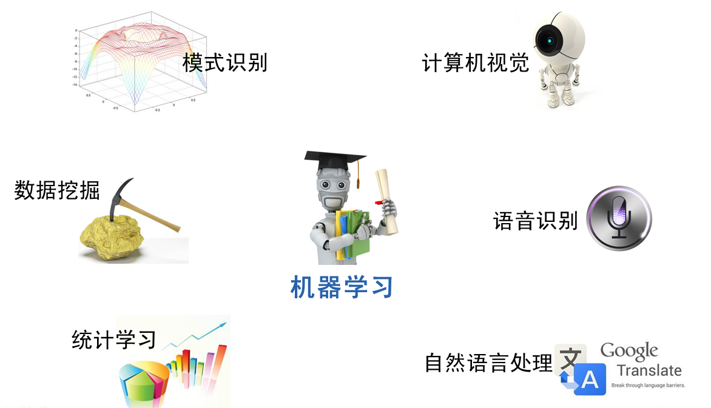

# 3 机器学习的范围
上文虽然说明了机器学习是什么，但是并没有给出机器学习的范围。

 

其实，机器学习跟模式识别，统计学习，数据挖掘，计算机视觉，语音识别，自然语言处理等领域有着很深的联系。

 

从范围上来说，机器学习跟模式识别，统计学习，数据挖掘是类似的，同时，机器学习与其他领域的处理技术的结合，形成了计算机视觉、语音识别、自然语言处理等交叉学科。因此，一般说数据挖掘时，可以等同于说机器学习。同时，我们平常所说的机器学习应用，应该是通用的，不仅仅局限在结构化数据，还有图像，音频等应用。

 

在这节对机器学习这些相关领域的介绍有助于我们理清机器学习的应用场景与研究范围，更好的理解后面的算法与应用层次。

 

下图是机器学习所牵扯的一些相关范围的学科与研究领域。

图6 机器学习与相关学科

 

模式识别
模式识别=机器学习。两者的主要区别在于前者是从工业界发展起来的概念，后者则主要源自计算机学科。在著名的《Pattern Recognition And Machine Learning》这本书中，Christopher M. Bishop在开头是这样说的“模式识别源自工业界，而机器学习来自于计算机学科。不过，它们中的活动可以被视为同一个领域的两个方面，同时在过去的10年间，它们都有了长足的发展”。

 

数据挖掘
数据挖掘=机器学习+数据库。这几年数据挖掘的概念实在是太耳熟能详。几乎等同于炒作。但凡说数据挖掘都会吹嘘数据挖掘如何如何，例如从数据中挖出金子，以及将废弃的数据转化为价值等等。但是，我尽管可能会挖出金子，但我也可能挖的是“石头”啊。这个说法的意思是，数据挖掘仅仅是一种思考方式，告诉我们应该尝试从数据中挖掘出知识，但不是每个数据都能挖掘出金子的，所以不要神话它。一个系统绝对不会因为上了一个数据挖掘模块就变得无所不能(这是IBM最喜欢吹嘘的)，恰恰相反，一个拥有数据挖掘思维的人员才是关键，而且他还必须对数据有深刻的认识，这样才可能从数据中导出模式指引业务的改善。大部分数据挖掘中的算法是机器学习的算法在数据库中的优化。

 

统计学习
统计学习近似等于机器学习。统计学习是个与机器学习高度重叠的学科。因为机器学习中的大多数方法来自统计学，甚至可以认为，统计学的发展促进机器学习的繁荣昌盛。例如著名的支持向量机算法，就是源自统计学科。但是在某种程度上两者是有分别的，这个分别在于：统计学习者重点关注的是统计模型的发展与优化，偏数学，而机器学习者更关注的是能够解决问题，偏实践，因此机器学习研究者会重点研究学习算法在计算机上执行的效率与准确性的提升。

 

计算机视觉
计算机视觉=图像处理+机器学习。图像处理技术用于将图像处理为适合进入机器学习模型中的输入，机器学习则负责从图像中识别出相关的模式。计算机视觉相关的应用非常的多，例如百度识图、手写字符识别、车牌识别等等应用。这个领域是应用前景非常火热的，同时也是研究的热门方向。随着机器学习的新领域深度学习的发展，大大促进了计算机图像识别的效果，因此未来计算机视觉界的发展前景不可估量。

 

语音识别
语音识别=语音处理+机器学习。语音识别就是音频处理技术与机器学习的结合。语音识别技术一般不会单独使用，一般会结合自然语言处理的相关技术。目前的相关应用有苹果的语音助手siri等。

 

自然语言处理
自然语言处理=文本处理+机器学习。自然语言处理技术主要是让机器理解人类的语言的一门领域。在自然语言处理技术中，大量使用了编译原理相关的技术，例如词法分析，语法分析等等，除此之外，在理解这个层面，则使用了语义理解，机器学习等技术。作为唯一由人类自身创造的符号，自然语言处理一直是机器学习界不断研究的方向。按照百度机器学习专家余凯的说法“听与看，说白了就是阿猫和阿狗都会的，而只有语言才是人类独有的”。如何利用机器学习技术进行自然语言的的深度理解，一直是工业和学术界关注的焦点。

 

可以看出机器学习在众多领域的外延和应用。机器学习技术的发展促使了很多智能领域的进步，改善着我们的生活。