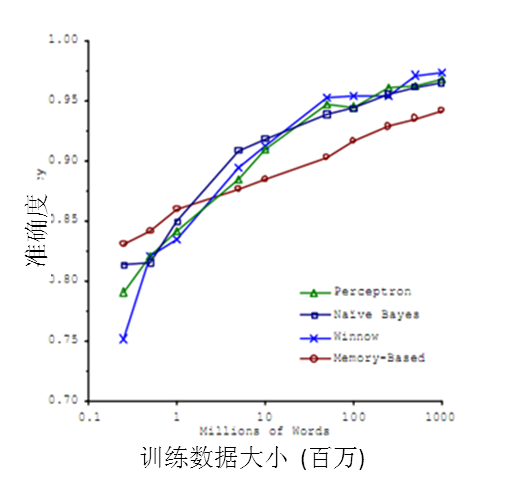

# 5 机器学习的应用--大数据

 

说完机器学习的方法，下面要谈一谈机器学习的应用了。无疑，在2010年以前，机器学习的应用在某些特定领域发挥了巨大的作用，如车牌识别，网络攻击防范，手写字符识别等等。但是，从2010年以后，随着大数据概念的兴起，机器学习大量的应用都与大数据高度耦合，几乎可以认为大数据是机器学习应用的最佳场景。

 

譬如，但凡你能找到的介绍大数据魔力的文章，都会说大数据如何准确准确预测到了某些事。例如经典的Google利用大数据预测了H1N1在美国某小镇的爆发。

图13 Google成功预测H1N1

 

百度预测2014年世界杯，从淘汰赛到决赛全部预测正确。

图14 百度世界杯成功预测了所有比赛结果

 

这些实在太神奇了，那么究竟是什么原因导致大数据具有这些魔力的呢？简单来说，就是机器学习技术。正是基于机器学习技术的应用，数据才能发挥其魔力。

 

大数据的核心是利用数据的价值，机器学习是利用数据价值的关键技术，对于大数据而言，机器学习是不可或缺的。相反，对于机器学习而言，越多的数据会越 可能提升模型的精确性，同时，复杂的机器学习算法的计算时间也迫切需要分布式计算与内存计算这样的关键技术。因此，机器学习的兴盛也离不开大数据的帮助。 大数据与机器学习两者是互相促进，相依相存的关系。

 

机器学习与大数据紧密联系。但是，必须清醒的认识到，大数据并不等同于机器学习，同理，机器学习也不等同于大数据。大数据中包含有分布式计算，内存数据库，多维分析等等多种技术。单从分析方法来看，大数据也包含以下四种分析方法：

 

1.大数据，小分析：即数据仓库领域的OLAP分析思路，也就是多维分析思想。
2.大数据，大分析：这个代表的就是数据挖掘与机器学习分析法。
3.流式分析：这个主要指的是事件驱动架构。
4.查询分析：经典代表是NoSQL数据库。

 

也就是说，机器学习仅仅是大数据分析中的一种而已。尽管机器学习的一些结果具有很大的魔力，在某种场合下是大数据价值最好的说明。但这并不代表机器学习是大数据下的唯一的分析方法。

 

机器学习与大数据的结合产生了巨大的价值。基于机器学习技术的发展，数据能够“预测”。对人类而言，积累的经验越丰富，阅历也广泛，对未来的判断越准确。例如常说的“经验丰富”的人比“初出茅庐”的小伙子更有工作上的优势，就在于经验丰富的人获得的规律比他人更准确。而在机器学习领域，根据著名的一个实验，有效的证实了机器学习界一个理论：即机器学习模型的数据越多，机器学习的预测的效率就越好。见下图：

图15 机器学习准确率与数据的关系

 

通过这张图可以看出，各种不同算法在输入的数据量达到一定级数后，都有相近的高准确度。于是诞生了机器学习界的名言：成功的机器学习应用不是拥有最好的算法，而是拥有最多的数据！

 

在大数据的时代，有好多优势促使机器学习能够应用更广泛。例如随着物联网和移动设备的发展，我们拥有的数据越来越多，种类也包括图片、文本、视频等非结构化数据，这使得机器学习模型可以获得越来越多的数据。同时大数据技术中的分布式计算Map-Reduce使得机器学习的速度越来越快，可以更方便的使用。种种优势使得在大数据时代，机器学习的优势可以得到最佳的发挥。