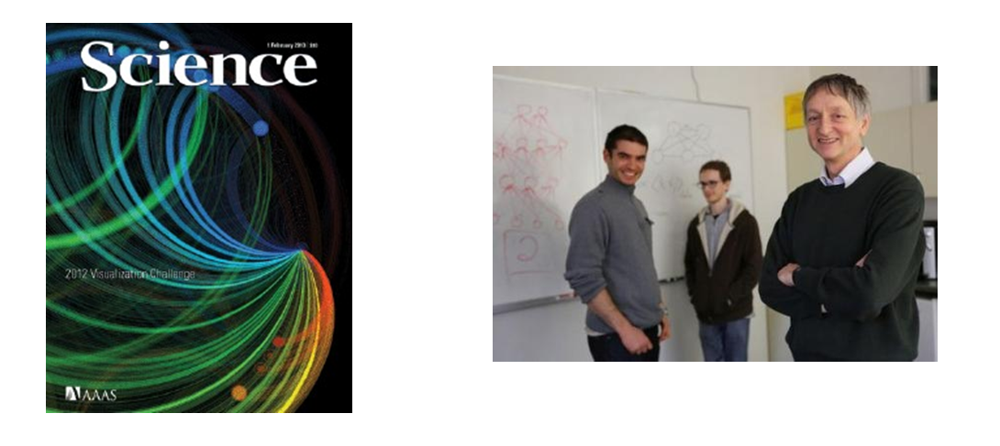
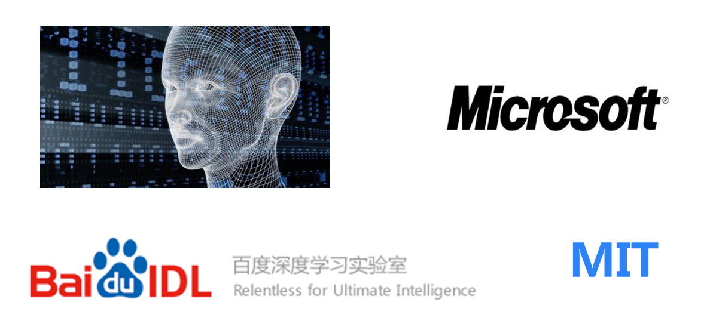

# 6 机器学习的子类--深度学习

 

近来，机器学习的发展产生了一个新的方向，即“深度学习”。

 

虽然深度学习这四字听起来颇为高大上，但其理念却非常简单，就是传统的神经网络发展到了多隐藏层的情况。

 

在上文介绍过，自从90年代以后，神经网络已经消寂了一段时间。但是BP算法的发明人Geoffrey Hinton一直没有放弃对神经网络的研究。由于神经网络在隐藏层扩大到两个以上，其训练速度就会非常慢，因此实用性一直低于支持向量机。2006年，Geoffrey Hinton在科学杂志《Science》上发表了一篇文章，论证了两个观点：

 

　　1.多隐层的神经网络具有优异的特征学习能力，学习得到的特征对数据有更本质的刻画，从而有利于可视化或分类；

　　2.深度神经网络在训练上的难度，可以通过“逐层初始化” 来有效克服。

图16 Geoffrey Hinton与他的学生在Science上发表文章

 

通过这样的发现，不仅解决了神经网络在计算上的难度，同时也说明了深层神经网络在学习上的优异性。从此，神经网络重新成为了机器学习界中的主流强大学习技术。同时，具有多个隐藏层的神经网络被称为深度神经网络，基于深度神经网络的学习研究称之为深度学习。

 

由于深度学习的重要性质，在各方面都取得极大的关注，按照时间轴排序，有以下四个标志性事件值得一说：

 

2012年6月，《纽约时报》披露了Google Brain项目，这个项目是由Andrew Ng和Map-Reduce发明人Jeff Dean共同主导，用16000个CPU Core的并行计算平台训练一种称为“深层神经网络”的机器学习模型，在语音识别和图像识别等领域获得了巨大的成功。Andrew Ng就是文章开始所介绍的机器学习的大牛(图1中左者)。

 

2012年11月，微软在中国天津的一次活动上公开演示了一个全自动的同声传译系统，讲演者用英文演讲，后台的计算机一气呵成自动完成语音识别、英中机器翻译，以及中文语音合成，效果非常流畅，其中支撑的关键技术是深度学习；

 

2013年1月，在百度的年会上，创始人兼CEO李彦宏高调宣布要成立百度研究院，其中第一个重点方向就是深度学习，并为此而成立深度学习研究院(IDL)。

 

2013年4月，《麻省理工学院技术评论》杂志将深度学习列为2013年十大突破性技术(Breakthrough Technology)之首。

图17 深度学习的发展热潮

 

文章开头所列的三位机器学习的大牛，不仅都是机器学习界的专家，更是深度学习研究领域的先驱。因此，使他们担任各个大型互联网公司技术掌舵者的原因不仅在于他们的技术实力，更在于他们研究的领域是前景无限的深度学习技术。

 

目前业界许多的图像识别技术与语音识别技术的进步都源于深度学习的发展，除了本文开头所提的Cortana等语音助手，还包括一些图像识别应用，其中典型的代表就是下图的百度识图功能。

图18 百度识图

 

深度学习属于机器学习的子类。基于深度学习的发展极大的促进了机器学习的地位提高，更进一步地，推动了业界对机器学习父类人工智能梦想的再次重视。