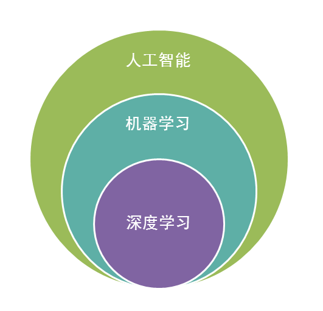
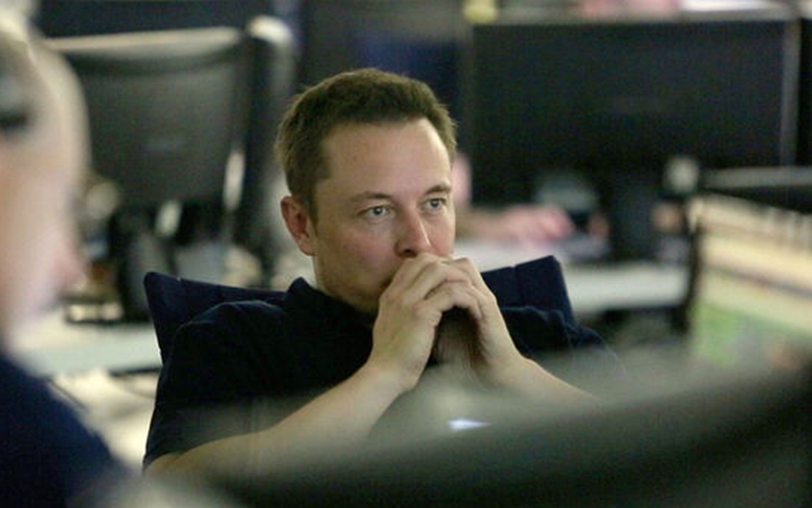

# 7 机器学习的父类--人工智能

 

人工智能是机器学习的父类。深度学习则是机器学习的子类。如果把三者的关系用图来表明的话，则是下图：

图19 深度学习、机器学习、人工智能三者关系

 

毫无疑问，人工智能(AI)是人类所能想象的科技界最突破性的发明了，某种意义上来说，人工智能就像游戏最终幻想的名字一样，是人类对于科技界的最终梦想。从50年代提出人工智能的理念以后，科技界，产业界不断在探索，研究。这段时间各种小说、电影都在以各种方式展现对于人工智能的想象。人类可以发明类似于人类的机器，这是多么伟大的一种理念！但事实上，自从50年代以后，人工智能的发展就磕磕碰碰，未有见到足够震撼的科学技术的进步。

 

总结起来，人工智能的发展经历了如下若干阶段，从早期的逻辑推理，到中期的专家系统，这些科研进步确实使我们离机器的智能有点接近了，但还有一大段距离。直到机器学习诞生以后，人工智能界感觉终于找对了方向。基于机器学习的图像识别和语音识别在某些垂直领域达到了跟人相媲美的程度。机器学习使人类第一次如此接近人工智能的梦想。

 

事实上，如果我们把人工智能相关的技术以及其他业界的技术做一个类比，就可以发现机器学习在人工智能中的重要地位不是没有理由的。

 

人类区别于其他物体，植物，动物的最主要区别，作者认为是“智慧”。而智慧的最佳体现是什么？

 

是计算能力么，应该不是，心算速度快的人我们一般称之为天才。
是反应能力么，也不是，反应快的人我们称之为灵敏。
是记忆能力么，也不是，记忆好的人我们一般称之为过目不忘。
是推理能力么，这样的人我也许会称他智力很高，类似“福尔摩斯”，但不会称他拥有智慧。
是知识能力么，这样的人我们称之为博闻广，也不会称他拥有智慧。

 

想想看我们一般形容谁有大智慧？圣人，诸如庄子，老子等。智慧是对生活的感悟，是对人生的积淀与思考，这与我们机器学习的思想何其相似？通过经验获取规律，指导人生与未来。没有经验就没有智慧。

 

图20 机器学习与智慧

 

那么，从计算机来看，以上的种种能力都有种种技术去应对。

 

例如计算能力我们有分布式计算，反应能力我们有事件驱动架构，检索能力我们有搜索引擎，知识存储能力我们有数据仓库，逻辑推理能力我们有专家系统，但是，唯有对应智慧中最显著特征的归纳与感悟能力，只有机器学习与之对应。这也是机器学习能力最能表征智慧的根本原因。

 

让我们再看一下机器人的制造，在我们具有了强大的计算，海量的存储，快速的检索，迅速的反应，优秀的逻辑推理后我们如果再配合上一个强大的智慧大脑，一个真正意义上的人工智能也许就会诞生，这也是为什么说在机器学习快速发展的现在，人工智能可能不再是梦想的原因。

 

人工智能的发展可能不仅取决于机器学习，更取决于前面所介绍的深度学习，深度学习技术由于深度模拟了人类大脑的构成，在视觉识别与语音识别上显著性的突破了原有机器学习技术的界限，因此极有可能是真正实现人工智能梦想的关键技术。无论是谷歌大脑还是百度大脑，都是通过海量层次的深度学习网络所构成的。也许借助于深度学习技术，在不远的将来，一个具有人类智能的计算机真的有可能实现。

 

最后再说一下题外话，由于人工智能借助于深度学习技术的快速发展，已经在某些地方引起了传统技术界达人的担忧。真实世界的“钢铁侠”，特斯拉CEO马斯克就是其中之一。最近马斯克在参加MIT讨论会时，就表达了对于人工智能的担忧。“人工智能的研究就类似于召唤恶魔，我们必须在某些地方加强注意。”

图21 马斯克与人工智能

 

尽管马斯克的担心有些危言耸听，但是马斯克的推理不无道理。“如果人工智能想要消除垃圾邮件的话，可能它最后的决定就是消灭人类。”马斯克认为预防此类现象的方法是引入政府的监管。在这里作者的观点与马斯克类似，在人工智能诞生之初就给其加上若干规则限制可能有效，也就是不应该使用单纯的机器学习，而应该是机器学习与规则引擎等系统的综合能够较好的解决这类问题。因为如果学习没有限制，极有可能进入某个误区，必须要加上某些引导。正如人类社会中，法律就是一个最好的规则，杀人者死就是对于人类在探索提高生产力时不可逾越的界限。

 

在这里，必须提一下这里的规则与机器学习引出的规律的不同，规律不是一个严格意义的准则，其代表的更多是概率上的指导，而规则则是神圣不可侵犯，不可修改的。规律可以调整，但规则是不能改变的。有效的结合规律与规则的特点，可以引导出一个合理的，可控的学习型人工智能。