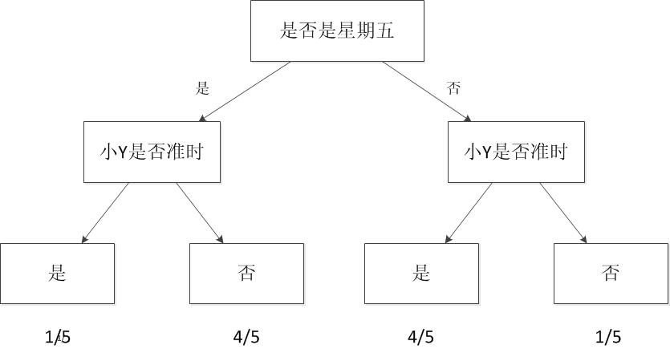

# a story
机器学习这个词是让人疑惑的，首先它是英文名称Machine Learning(简称ML)的直译，在计算界Machine一般指计算机。这个名字使用了拟人的手法，说明了这门技术是让机器“学习”的技术。但是计算机是死的，怎么可能像人类一样“学习”呢？

 
传统上如果我们想让计算机工作，我们给它一串指令，然后它遵照这个指令一步步执行下去。有因有果，非常明确。但这样的方式在机器学习中行不通。机器学习根本不接受你输入的指令，相反，它接受你输入的数据! 也就是说，机器学习是一种让计算机利用数据而不是指令来进行各种工作的方法。这听起来非常不可思议，但结果上却是非常可行的。“统计”思想将在你学习“机器学习”相关理念时无时无刻不伴随，相关而不是因果的概念将是支撑机器学习能够工作的核心概念。你会颠覆对你以前所有程序中建立的因果无处不在的根本理念。

 

下面我通过一个故事来简单地阐明什么是机器学习。这个故事比较适合用在知乎上作为一个概念的阐明。在这里，这个故事没有展开，但相关内容与核心是存在的。如果你想简单的了解一下什么是机器学习，那么看完这个故事就足够了。如果你想了解机器学习的更多知识以及与它关联紧密的当代技术，那么请你继续往下看，后面有更多的丰富的内容。

 

这个例子来源于我真实的生活经验，我在思考这个问题的时候突然发现它的过程可以被扩充化为一个完整的机器学习的过程，因此我决定使用这个例子作为所有介绍的开始。这个故事称为“等人问题”。

 

我相信大家都有跟别人相约，然后等人的经历。现实中不是每个人都那么守时的，于是当你碰到一些爱迟到的人，你的时间不可避免的要浪费。我就碰到过这样的一个例子。

 

对我的一个朋友小Y而言，他就不是那么守时，最常见的表现是他经常迟到。当有一次我跟他约好3点钟在某个麦当劳见面时，在我出门的那一刻我突然想到一个问题：我现在出发合适么？我会不会又到了地点后，花上30分钟去等他？我决定采取一个策略解决这个问题。

 

要想解决这个问题，有好几种方法。第一种方法是采用知识：我搜寻能够解决这个问题的知识。但很遗憾，没有人会把如何等人这个问题作为知识传授，因此我不可能找到已有的知识能够解决这个问题。第二种方法是问他人：我去询问他人获得解决这个问题的能力。但是同样的，这个问题没有人能够解答，因为可能没人碰上跟我一样的情况。第三种方法是准则法：我问自己的内心，我有否设立过什么准则去面对这个问题？例如，无论别人如何，我都会守时到达。但我不是个死板的人，我没有设立过这样的规则。

 

事实上，我相信有种方法比以上三种都合适。我把过往跟小Y相约的经历在脑海中重现一下，看看跟他相约的次数中，迟到占了多大的比例。而我利用这来预测他这次迟到的可能性。如果这个值超出了我心里的某个界限，那我选择等一会再出发。假设我跟小Y约过5次，他迟到的次数是1次，那么他按时到的比例为80%，我心中的阈值为70%，我认为这次小Y应该不会迟到，因此我按时出门。如果小Y在5次迟到的次数中占了4次，也就是他按时到达的比例为20%，由于这个值低于我的阈值，因此我选择推迟出门的时间。这个方法从它的利用层面来看，又称为经验法。在经验法的思考过程中，我事实上利用了以往所有相约的数据。因此也可以称之为依据数据做的判断。

 

依据数据所做的判断跟机器学习的思想根本上是一致的。

 

刚才的思考过程我只考虑“频次”这种属性。在真实的机器学习中，这可能都不算是一个应用。一般的机器学习模型至少考虑两个量：一个是因变量，也就是我们希望预测的结果，在这个例子里就是小Y迟到与否的判断。另一个是自变量，也就是用来预测小Y是否迟到的量。假设我把时间作为自变量，譬如我发现小Y所有迟到的日子基本都是星期五，而在非星期五情况下他基本不迟到。于是我可以建立一个模型，来模拟小Y迟到与否跟日子是否是星期五的概率。见下图：

图3 决策树模型

这样的图就是一个最简单的机器学习模型，称之为决策树。

当我们考虑的自变量只有一个时，情况较为简单。如果把我们的自变量再增加一个。例如小Y迟到的部分情况时是在他开车过来的时候(你可以理解为他开车水平较臭，或者路较堵)。于是我可以关联考虑这些信息。建立一个更复杂的模型，这个模型包含两个自变量与一个因变量。

 

再更复杂一点，小Y的迟到跟天气也有一定的原因，例如下雨的时候，这时候我需要考虑三个自变量。

 

如果我希望能够预测小Y迟到的具体时间，我可以把他每次迟到的时间跟雨量的大小以及前面考虑的自变量统一建立一个模型。于是我的模型可以预测值，例如他大概会迟到几分钟。这样可以帮助我更好的规划我出门的时间。在这样的情况下，决策树就无法很好地支撑了，因为决策树只能预测离散值。我们可以用节2所介绍的线型回归方法建立这个模型。

 

如果我把这些建立模型的过程交给电脑。比如把所有的自变量和因变量输入，然后让计算机帮我生成一个模型，同时让计算机根据我当前的情况，给出我是否需要迟出门，需要迟几分钟的建议。那么计算机执行这些辅助决策的过程就是机器学习的过程。

 

**机器学习方法是计算机利用已有的数据(经验)，得出了某种模型(迟到的规律)，并利用此模型预测未来(是否迟到)的一种方法。**

 

通过上面的分析，可以看出机器学习与人类思考的经验过程是类似的，不过它能考虑更多的情况，执行更加复杂的计算。事实上，机器学习的一个主要目的就是把人类思考归纳经验的过程转化为计算机通过对数据的处理计算得出模型的过程。经过计算机得出的模型能够以近似于人的方式解决很多灵活复杂的问题。