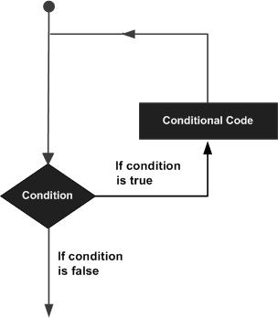

# Python基础 （1）
## 语句
#### 条件语句
Python条件语句是通过一条或多条语句的执行结果（True或者False）来决定执行的代码块。

可以通过下图来简单了解条件语句的执行过程:

Python程序语言指定任何非0和非空（null）值为true，0 或者 null为false。
Python 编程中 if 语句用于控制程序的执行，基本形式为：
> if 判断条件：
    执行语句……
else：
    执行语句……

其中"判断条件"成立时（非零），则执行后面的语句，而执行内容可以多行，以缩进来区分表示同一范围。
else 为可选语句，当需要在条件不成立时执行内容则可以执行相关语句，具体例子如下： 
```python
#!/usr/bin/python
# -*- coding: UTF-8 -*-
 
# 例1：if 基本用法
 
flag = False
name = 'luren'
if name == 'python':         # 判断变量否为'python'
    flag = True          # 条件成立时设置标志为真
    print 'welcome boss'    # 并输出欢迎信息
else:
    print name              # 条件不成立时输出变量名称
```
if 语句的判断条件可以用>（大于）、<(小于)、==（等于）、>=（大于等于）、<=（小于等于）来表示其关系。

当判断条件为多个值时，可以使用以下形式：

> if 判断条件1:
    执行语句1……
elif 判断条件2:
    执行语句2……
elif 判断条件3:
    执行语句3……
else:
    执行语句4……

实例如下：
```python
#!/usr/bin/python
# -*- coding: UTF-8 -*-
# 例2：elif用法
 
num = 5     
if num == 3:            # 判断num的值
    print 'boss'        
elif num == 2:
    print 'user'
elif num == 1:
    print 'worker'
elif num < 0:           # 值小于零时输出
    print 'error'
else:
    print 'roadman'     # 条件均不成立时输出
```
由于 python 并不支持 switch 语句，所以多个条件判断，只能用 elif 来实现，如果判断需要多个条件需同时判断时，可以使用 or （或），表示两个条件有一个成立时判断条件成功；使用 and （与）时，表示只有两个条件同时成立的情况下，判断条件才成功。
```python

#!/usr/bin/python
# -*- coding: UTF-8 -*-
 
# 例3：if语句多个条件
 
num = 9
if num >= 0 and num <= 10:    # 判断值是否在0~10之间
    print 'hello'
# 输出结果: hello
 
num = 10
if num < 0 or num > 10:    # 判断值是否在小于0或大于10
    print 'hello'
else:
    print 'undefine'
# 输出结果: undefine
 
num = 8
# 判断值是否在0~5或者10~15之间
if (num >= 0 and num <= 5) or (num >= 10 and num <= 15):    
    print 'hello'
else:
    print 'undefine'
# 输出结果: undefine
```

当if有多个条件时可使用括号来区分判断的先后顺序，括号中的判断优先执行，此外 and 和 or 的优先级低于>（大于）、<（小于）等判断符号，即大于和小于在没有括号的情况下会比与或要优先判断。


***
#### 循环语句
循环语句允许我们执行一个语句或语句组多次，下面是在大多数编程语言中的循环语句的一般形式：

Python提供了for循环和while循环（在Python中没有do..while循环）:
##### while循环语句
Python 编程中 while 语句用于循环执行程序，即在某条件下，循环执行某段程序，以处理需要重复处理的相同任务。其基本形式为：

>while 判断条件：
    执行语句……

执行语句可以是单个语句或语句块。判断条件可以是任何表达式，任何非零、或非空（null）的值均为true。
当判断条件假false时，循环结束。
```python
#!/usr/bin/python
count = 0
while (count < 9):
   print 'The count is:', count
   count = count + 1
 
print "Good bye!"
```
##### for循环语句
Python for循环可以遍历任何序列的项目，如一个列表或者一个字符串。
for循环的语法格式如下：
>for iterating_var in sequence:
   statements(s)

```python
#!/usr/bin/python
# -*- coding: UTF-8 -*-
 
for letter in 'Python':     # 第一个实例
   print '当前字母 :', letter
 
fruits = ['banana', 'apple',  'mango']
for fruit in fruits:        # 第二个实例
   print '当前水果 :', fruit
 
print "Good bye!"
```