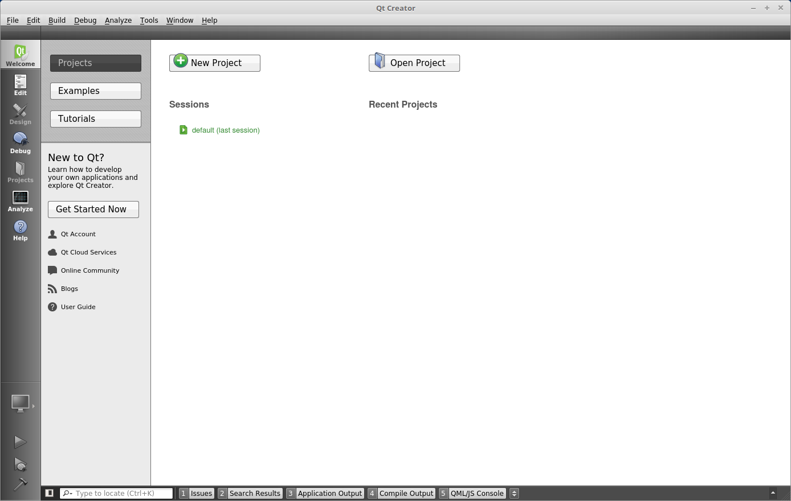

# 操作容器

[toc]

## 镜像和容器的概念
利用前一节的内容，我们成功获取了ubuntu 16.04的镜像，而我们也尝试了使用run命令根据镜像创建并使用了一个容器。那么容器和镜像是什么样的关系呢？
形象的说，镜像就是未开启的状态系统，像是一台台虚拟的电脑, 而容器就是电脑开启后的一个状态，使用Docker可以方便地获取到各种各样的电脑配置。镜像（Image）和容器（Container）之间存在以下关系：

1. 所有容器都来源于镜像。这个很好理解，一台开着的电脑必定是从关着的电脑开启的，使用run命令可以开启镜像创建容器;
2. 容器可以持久化到镜像。这个也很好理解，打开一台电脑，进行一系列操作后关机，我们把这个时候电脑的状态固化下来，就形成了一个新的镜像，这个操作是由commit命令完成的;
3. 镜像与镜像之间存在继承关系。这个很像github的结构，例如我们对ubuntu镜像进行了操作并形成了一个新的镜像，这个新的镜像包含了所有ubuntu镜像的信息，这样由不断的操作最终可以构成一个镜像依赖树，我们在pull子镜像时会自动pull父镜像，同时，所有的镜像都来源于一个空镜像<none>。

```
$ docker images # 列出镜像，可-a显示全部
$ docker ps -a  # 列出容器
$ docker rmi <imagename> # 删除镜像
$ docker rm  <container_id> # 删除指定镜像
$ docker rm $(docker ps -a -q) # 删除所有已经停止的容器
```

## 创建并启动容器 -- run
启动容器有两种方式，一种是基于镜像新建一个容器并启动，另外一个是将在终止状态（stopped）的容器重新启动。

因为 Docker 的容器实在太轻量级了，很多时候用户都是随时删除和新创建容器。而构建一个容器所需要的命令主要为 `docker run`。

* 例如，下面的命令输出一个 “Hello World”，之后终止容器。
```
$ sudo docker run --rm ubuntu:16.04 /bin/echo 'Hello world'
Hello world
```
这跟在本地直接执行 `/bin/echo 'hello world'` 几乎感觉不出任何区别。其中`--rm` 选项会在终止容器后自动删除容器。

* 下面的命令则启动一个 bash 终端，允许用户进行交互。
```
$ sudo docker run -t -i ubuntu:16.04 /bin/bash
root@af8bae53bdd3:/#
```
其中，`-t` 选项让Docker分配一个伪终端（pseudo-tty）并绑定到容器的标准输入上， `-i` 则让容器的标准输入保持打开。

在交互模式下，用户可以通过所创建的终端来输入命令，例如
```
root@af8bae53bdd3:/# pwd
/
root@af8bae53bdd3:/# ls
bin boot dev etc home lib lib64 media mnt opt proc root run sbin srv sys tmp usr var
```

当利用 `docker run` 来创建容器时，Docker 在后台运行的标准操作包括：

* 检查本地是否存在指定的镜像，不存在就从公有仓库下载
* 利用镜像创建并启动一个容器
* 分配一个文件系统，并在只读的镜像层外面挂载一层可读写层
* 从宿主主机配置的网桥接口中桥接一个虚拟接口到容器中去
* 从地址池配置一个 ip 地址给容器
* 执行用户指定的应用程序
* 执行完毕后容器被终止

## 启动已终止容器 - start，attach，exec
* 从ubuntu创建一个新容器，并使用`--name`选项定义容器名字，若不定义名字，系统会随机分配名字，然后我们在里面创建一个文件夹。
```
$docker run -t -i --name container_test ubuntu:16.04 /bin/bash
root@af8bae53bdd3:/#mkdir /home/zhaoyong;ls /home
zhaoyong
```

* 使用`docker ps -a`可以看到刚创建的容器：

```
$docker ps -a
CONTAINER ID        IMAGE               COMMAND                  CREATED              STATUS                        PORTS               NAMES
46e6732b189b        ubuntu:16.04        "/bin/bash"              About a minute ago   Exited (130) 5 seconds ago                        container_test
```
* 可以利用 `docker start` 命令，直接将一个已经终止的容器启动运行,使用attach或者exec命令可重新操作容器,如enter后没有显示，可再按enter键：
```
$docker start container_test
container_test
$docker attach container_test
root@46e6732b189b:/# ls /home/
zhaoyong
```
可以看到，之前创建的文件夹被保留下来了。

* 容器的核心为所执行的应用程序，所需要的资源都是应用程序运行所必需的。除此之外，并没有其它的资源。可以在伪终端中利用 `ps` 或 `top` 来查看进程信息。
```
root@46e6732b189b:/# ps
  PID TTY          TIME CMD
    1 ?        00:00:00 bash
   11 ?        00:00:00 ps
```
可见，容器中仅运行了指定的 bash 应用。这种特点使得 Docker 对资源的利用率极高，是货真价实的轻量级虚拟化。

## 给容器添加GUI显示支持
利用Docker高效且资源消耗较少的特点，可以用来完成非常酷炫的效果，Docker开发团队的Jessie在演讲上展示了她如何使用Docker来[部署各种各样的应用](https://pan.baidu.com/s/1bn0hdpH)。

那么如何达到这样的效果呢？

* 首先我们创建一个容器：
```
$docker run -it --net=host --privileged -e DISPLAY=$DISPLAY -v /tmp/.X11-unix:/tmp/.X11-unix -v /home:/home --name containergui ubuntu:16.04 bash
```
其中:
-it         : 同-i -t，开启交互
--net=host  ：设置网络模式为同主机
--privileged：开启在主机中的root权限
-e          ：设置环境变量
-v          ：挂载主机中的文件或文件夹到容器中
--name      ：设置别名

* 更新软件源，同时在容器中安装qtcreator：
```
root@zhaoyong-System-Product-Name:/# apt update
Get:1 http://archive.ubuntu.com/ubuntu xenial InRelease [247 kB]
Get:2 http://security.ubuntu.com/ubuntu xenial-security InRelease [102 kB]
Get:3 http://archive.ubuntu.com/ubuntu xenial-updates InRelease [102 kB]
...
Fetched 24.4 MB in 14s (1683 kB/s)     
Reading package lists... Done
Building dependency tree       
Reading state information... Done
2 packages can be upgraded. Run 'apt list --upgradable' to see them.
root@zhaoyong-System-Product-Name:/# apt install qtcreator
...
```
* 尝试执行程序，但是会弹出错误：
```
root@zhaoyong-System-Product-Name:/# qtcreator
No protocol specified
qtcreator: cannot connect to X server :0
```

* 上面错误是由于主机不允许容器中的显示，只需要在主机中运行：
```
xhost +
```

* 再次运行qtcreator，即可看到运行界面：



* 若仍然显示错误，可以考虑是由于容器和宿主所安装的显卡驱动不统一造成的，这个时候需要在容器中安装与宿主机器相同版本的显卡驱动，如若显卡驱动是与cuda一同安装的，请安装与宿主同一版本的cuda。


*注：经测试，在部分机器中，依赖OpenGL的GUI程序无法成功运行，暂时还未找到解决方案，欢迎大家分享补充。*

## 容器持久化 - commit

* 对于上述容器containergui，可以使用commit命令将其持久化到镜像中：

```
docker commit containergui qtcreator
```
使用`docker images`可以看到列表中新增了qtcreator镜像。

* 持久化之后，我们就可以把qtcreator镜像作为应用程序打开
```
xhost +;docker run -d --rm --net=host --privileged -e DISPLAY=$DISPLAY -v /tmp/.X11-unix:/tmp/.X11-unix -v /home:/home qtcreator qtcreator
```

其中`-d`是在后台运行容器并返回容器ID，通过'docker log <container_id>'可以查看其输出。


* 为了使用方便，可以将下述代码添加到`~/.bashrc`中：

```
qtcreator()
{
xhost +;
docker run -d --rm --net=host --privileged -e DISPLAY=$DISPLAY -v /tmp/.X11-unix:/tmp/.X11-unix -v /home:/home qtcreator qtcreator $1
}
```
这样之后只需要直接使用qtcreator命令即可运行程序。


## 下一节[Dockerfile](dockerfile.md)


